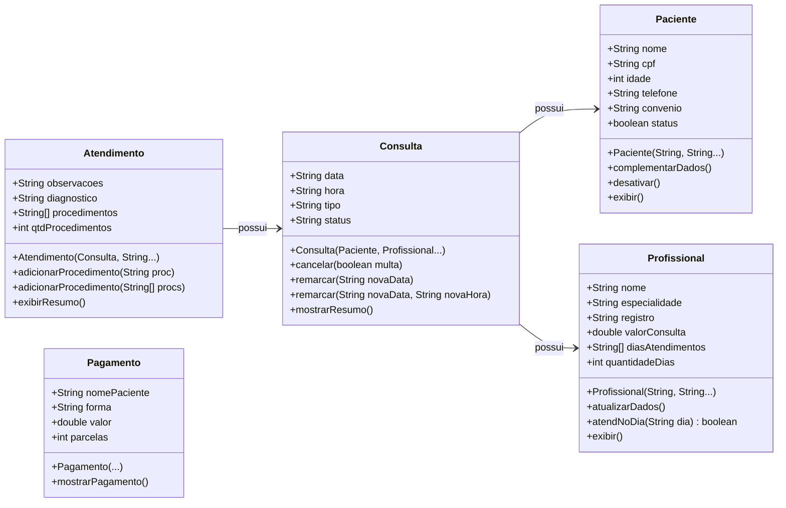

# Documentação do Projeto: Sistema de Clínica Médica

---

## Abaixo estão as trilhas que o usuário faz para atingir seus principais objetivos dentro do sistema.

### 1. Trilha de Cadastro de Paciente (Triagem)
**Objetivo:** Registrar um novo paciente no sistema.
1. O usuário acessa o **Menu Principal** e escolhe a opção `1 - Cadastrar paciente`.
2. O sistema abre o **Menu do Cliente** e o usuário escolhe `1 - Cadastrar cliente`.
3. O usuário seleciona o nível de detalhe (Rápido, Intermediário ou Completo).
4. O sistema solicita os dados pertinentes (Nome, CPF, Idade, Telefone, Convênio).
5. O paciente é instanciado e salvo no array `pacientes[]`.

### 2. Trilha de Complemento/Atualização de Dados
**Objetivo:** Adicionar informações como convênio e telefone a um paciente de cadastro rápido.
1. O usuário acessa o **Menu de Pacientes** e escolhe `4 - Complementar Cadastro`.
2. O usuário informa o **CPF** do paciente desejado.
3. O sistema varre o array e localiza o paciente.
4. O usuário escolhe o tipo de complemento e insere os novos dados (idade, telefone, convênio).
5. O sistema chama o método `complementarDados()`.

### 3. Trilha de Desativação de Paciente
**Objetivo:** Inativar um paciente que não frequenta mais a clínica.
1. O usuário acessa o **Menu de Pacientes** e escolhe `5 - Desativar Paciente`.
2. O usuário informa o **CPF**.
3. O sistema localiza o paciente e executa o método `desativar()`, alterando o status interno dele para `inativo`.

### 4. Trilha de Cadastro de Profissional Médico
**Objetivo:** Adicionar um novo médico ao quadro de funcionários.
1. O usuário acessa o **Menu Principal** e escolhe `2 - Funcionários`.
2. Em seguida, escolhe a opção `1 - Cadastrar profissional`.
3. Define se o cadastro é **Simples** (apenas nome e especialidade) ou **Completo** (adicionando CRM, valor da consulta e dias de atendimento).
4. O profissional é instanciado e adicionado ao array `profissionais[]`.

### 5. Trilha de Agendamento de Consulta
**Objetivo:** Marcar um horário de um paciente com um médico.
1. O usuário acessa `3 - Consultas` no Menu Principal e escolhe `1 - Agendar Consulta`.
2. O sistema exibe os pacientes disponíveis e o usuário seleciona um pelo **índice numérico**.
3. O sistema exibe os profissionais disponíveis e o usuário seleciona um.
4. O usuário insere a Data (`dd/mm/aaaa`), a Hora e o Tipo de consulta (avaliação, retorno).
5. Uma nova `Consulta` é gerada com o status inicial `agendada`.

### 6. Trilha de Remarcação de Consulta
**Objetivo:** Alterar a data ou o horário de uma consulta previamente agendada.
1. No menu de **Consultas**, o usuário escolhe `4 - Remarcar Consulta`.
2. O usuário indica o índice da consulta.
3. O sistema pede a Nova Data e a Nova Hora.
4. O método `remarcar()` da classe consulta é invocado, o qual atualiza os atributos e altera o status para `remarcada`.

### 7. Trilha de Registro de Atendimento Clínico (Pós-Consulta)
**Objetivo:** O médico realiza a consulta e anota o diagnóstico e os procedimentos.
1. O usuário acessa `5 - Atendimentos` no Menu Principal e escolhe `1 - Registrar Atendimento`.
2. O usuário seleciona o paciente.
3. O sistema lista as consultas desse paciente que estão como `agendada`. O usuário seleciona a consulta do momento.
4. O usuário escolhe o tipo de registro clínico (Apenas observações, com diagnóstico, ou completo com procedimentos).
5. Se for completo, o usuário insere os procedimentos efetuados. O atendimento é instanciado e a consulta passa para o status `realizada`.

### 8. Trilha de Acerto Financeiro (Pagamento)
**Objetivo:** Receber o pagamento do paciente após o atendimento.
1. O usuário acessa `4 - Pagamentos` e escolhe `1 - Realizar pagamento de consulta`.
2. O usuário seleciona no índice qual consulta está sendo paga.
3. O sistema identifica o valor da consulta do médico e **aplica os descontos automaticamente** caso o paciente possua convênio (Unimed: 30%, Hapvida: 20%, SUS: 15%).
4. O usuário escolhe a forma (Cartão, Dinheiro, Pix). Se for cartão, escolhe as parcelas.
5. Um objeto `Pagamento` é gerado e o comprovante é exibido em tela.

### 9. Trilha de Cancelamento com (ou sem) Multa
**Objetivo:** Cancelar a consulta de um paciente.
1. O usuário acessa `3 - Consultas` e escolhe `3 - Cancelar Consulta`.
2. O usuário informa o índice da consulta.
3. O sistema pergunta se será aplicada a **multa de cancelamento de R$ 50,00** (devido ao cancelamento tardio, por exemplo).
4. O método `cancelar()` atua no status da consulta, que passa a ser `cancelada`.

### 10. Trilha de Geração de Relatórios
**Objetivo:** Verificar a base de dados de pagamentos ou prontuários.
1. Em qualquer um dos submenus, o usuário utiliza a opção de `Listagem` (ex: Listar Consultas, Listar Pagamentos Realizados, Listar Atendimentos).
2. O sistema varre os arrays e chama os métodos de resumo (`mostrarResumo()`, `exibirResumo()`, `mostrarPagamento()`), gerando um console de informações gerenciais fáceis de ler para a recepção da clínica.

---

